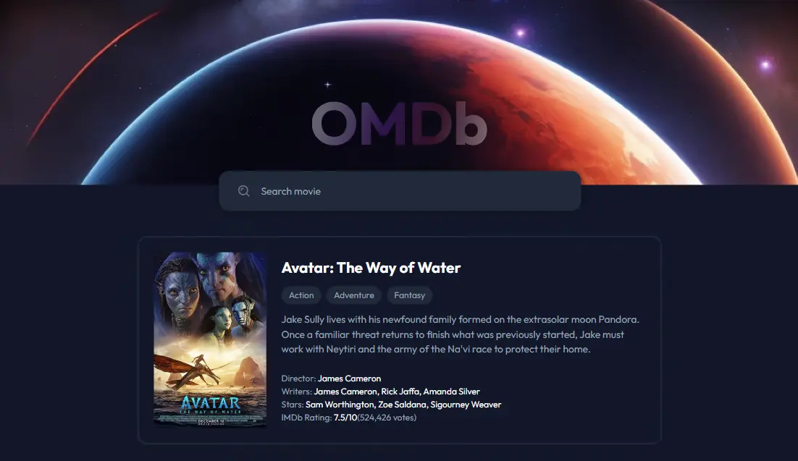

# Movie Search App

Una aplicación web para buscar información sobre películas utilizando la API de OMDb.

## Descripción

Esta aplicación permite a los usuarios buscar películas por título y obtener información detallada sobre ellas, incluyendo el director, escritores, actores, calificación de IMDb y más. La aplicación también proporciona sugerencias de autocompletado mientras el usuario escribe en el campo de búsqueda.

## Características

- Búsqueda de películas por título
- Autocompletado de títulos de películas
- Visualización de detalles de la película
- Manejo de errores cuando no se encuentran resultados

## Vista Previa



Puedes ver la versión demo en vivo aquí: [Movie Search App](https://movie-search-app-ten-woad.vercel.app/)

## Tecnologías Utilizadas

- HTML
- CSS
- JavaScript
- API de OMDb

## Instalación

1. Clona el repositorio:
    ```bash
    git clone https://github.com/Ibrahim-003/movie-search-app.git
    ```

2. Navega al directorio del proyecto:
    ```bash
    cd movie-search-app
    ```

3. Abre el archivo [index.html](http://_vscodecontentref_/0) en tu navegador preferido.

## Uso

1. Ingresa el título de una película en el campo de búsqueda.
2. Selecciona una sugerencia de autocompletado o presiona el botón de búsqueda.
3. La información de la película se mostrará en la página.

## Estructura del Proyecto
```movie-search-app/
├── css/
│ ├── reset.css
│ │── styles.css
├── images/
│ └── OMDb-logo.svg
├── js/
│ ├── data.js
│ ├── eventListeners.js
│ ├── main.js
│ ├── movieCard.js
│ └── notFound.js
├── index.html
└── README.md
```

## Autor 👨‍💻
Desarrollado por **[Ibrahim Almeyda](https://github.com/Ibrahim-003)**.
